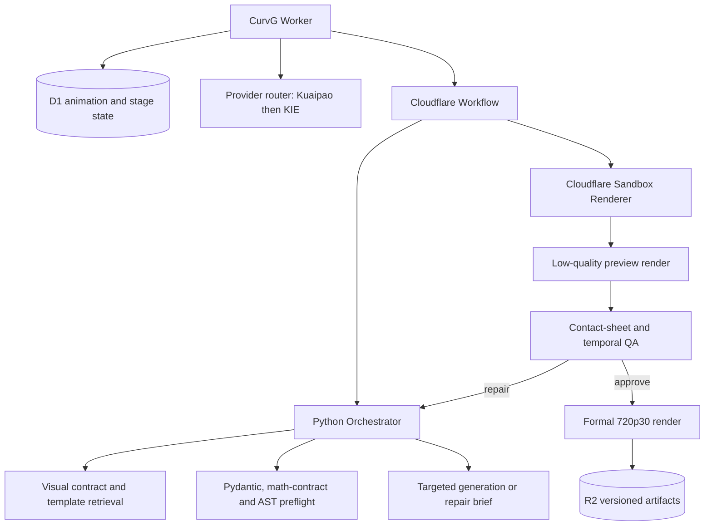

# CurvG Animation Orchestration

## Runtime architecture



The Worker remains the owner of authentication, subscriptions, credits,
provider credentials, model selection, D1 state, and renderer callbacks. The
Python service receives one bounded animation specification at a time and owns
only deterministic planning and preflight decisions.

## Durable execution

The Workflow has three durable boundaries:

1. `plan-animation` runs the six persisted planning specialists. Every stage
   writes its input hash, artifact, attempt, provider diagnostic, and status to
   D1, so a Workflow replay reuses completed stages.
2. `prepare-python-orchestrator` derives the visual contract, retrieves visual
   templates, and produces the code-generation brief. Cloudflare retries this
   external step with exponential delay. After the retry budget is exhausted,
   the Workflow records a degraded checkpoint and uses the in-Worker compiler.
3. `compile-and-render-animation` generates code, runs Python AST preflight,
   performs at most one targeted pre-render repair, reserves credits, and
   dispatches the renderer.

The Python service is intentionally optional. A network outage must reduce
quality assistance, not make an otherwise valid animation impossible to
render.

## Versioned contracts

- Transport protocol: `curvg.orchestrator/v1`
- Visual contract: `curvg.visual/v1`
- Animation specification: CurvG schema version 5

The visual contract makes these requirements machine-readable:

- 16:9 or 9:16 frame and normalized safe zone.
- 30 fps delivery target.
- Visible motion in the first second.
- A resolved payoff in the final third.
- Bounded prose and simultaneous text.
- One dominant visual action per teaching beat.
- Geometry and motion must carry the proof instead of prose alone.

The service returns diagnostics with a stable code, severity, stage, message,
and optional JSON path. Blocking code diagnostics become a targeted repair
directive; warnings remain inspectable and do not stop rendering.

## Validation boundaries

The Python mathematical validator checks the _mathematical contract_: scoped
claim, definitions, derivation, independent checks, limitations, timeline
references, and whether the declared visual action actually demonstrates a
dynamic claim. It does not claim to prove arbitrary mathematics. The existing
independent model audit and any deterministic solver remain responsible for
topic-specific verification.

AST preflight rejects unsupported imports, dynamic evaluation, external file
or URL access, blocked updater patterns, invalid scene inheritance, and scenes
without enough explicit motion. The renderer repeats a stricter AST check in
the disposable Sandbox; preflight is not a replacement for isolation.

## Renderer quality ladder

Each autonomous repair attempt uses Manim `-ql`. The renderer extracts twelve
frames and analyzes occupancy, edge risk, contrast, black/frozen segments, and
flash frames. The quality gate can request a targeted repair and preserves the
highest-ranked preview when later repairs regress.

After approval, the selected source is rendered again with `-qm`. Thumbnail,
contact sheet, and QA JSON are regenerated from that formal MP4, then the
formal video and evidence are uploaded to R2. Preview media is never delivered
as the final artifact.

## Configuration

The service can be configured in Admin Settings or through server-only
environment fallbacks:

```env
ANIMATION_ORCHESTRATOR_URL=https://orchestrator.example.com
ANIMATION_ORCHESTRATOR_TOKEN=<shared bearer token>
```

The same token must be present as `ORCHESTRATOR_TOKEN` in the Python container.
Production URLs must use HTTPS. Local development permits localhost HTTP.

## Verification

```bash
pnpm orchestrator:test
pnpm renderer:typecheck
pnpm test
pnpm build
pnpm cf:build
pnpm exec wrangler deploy --dry-run
```

The default production target is Cloudflare Containers through the dedicated
`orchestrator/wrangler.jsonc` Worker adapter. The Docker image remains
platform-neutral and can
run on Modal, Cloud Run, Fly.io, Railway, or another HTTPS container runtime.
No production service is active until its URL and bearer token are configured.
