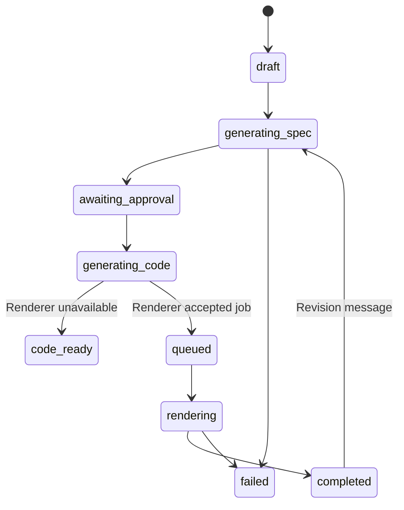
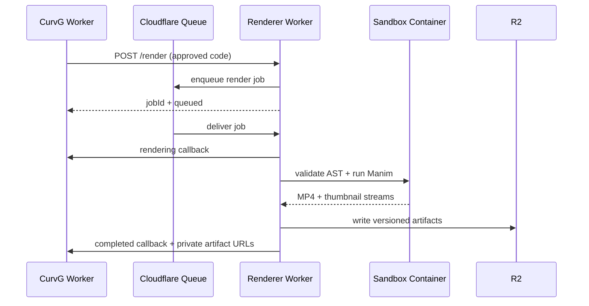

# CurvG Creator Architecture

## First-principles decomposition

A precise mathematical animation requires four separate truths:

1. **Conversation truth** — what the user requested and how the request changed.
2. **Specification truth** — equations, coordinate systems, objects, timing and transformations before code exists.
3. **Execution truth** — inspectable Manim source generated from the approved specification.
4. **Artifact truth** — immutable rendered files and version metadata stored outside the execution container.

Combining these into one opaque model call makes failures impossible to diagnose. CurvG therefore uses an explicit approval boundary between specification and code generation.

## Reused template infrastructure

- `chat` stores one animation project and its current structured state in `parts`.
- `chat_message` stores the conversation history.
- Better Auth owns user identity and authorization.
- Admin settings provide encrypted OpenAI-compatible or Anthropic credentials.
- D1 stores projects and messages.
- D1 stores generated code and version snapshots; R2 stores videos and thumbnails.

No new database table is required for the first implementation.

## State machine



## Provider boundary

CurvG exposes a provider-neutral chat completion interface. The first adapters are:

- OpenAI-compatible `/chat/completions`, which also supports gateways such as OpenRouter when configured by the administrator.
- Anthropic `/v1/messages`.

Model IDs are configuration, not source-code constants. This prevents the application from depending on names that change over time.

## Renderer boundary

The web application does not execute generated Python. It dispatches approved code to an authenticated renderer endpoint.

The Cloudflare implementation is a separate Worker using Queue, Sandbox SDK, a custom Python image containing Manim, FFmpeg and LaTeX, and R2. The Sandbox filesystem is disposable; final artifacts are streamed to R2 and returned through an authenticated callback.

Until a renderer endpoint is configured, CurvG stops at `code_ready` and clearly reports that rendering is not configured. It does not pretend that a video was rendered.



## Security boundary

- Generated code is untrusted and never runs inside the application Worker.
- Prompt and message lengths are bounded.
- API access is scoped to the authenticated owner.
- Generated code is rejected when it contains direct filesystem, network, subprocess or dynamic-evaluation primitives.
- Renderer callbacks require a shared bearer token.
- Provider and renderer secrets remain server-side and are encrypted in the config table.
- The renderer accepts callbacks only for the configured CurvG origin.
- Queue messages isolate long render time from interactive Worker requests.
- R2 keys include the render job ID, so a revision cannot serve a previous video.
- Artifact routes require the animation owner's session and support byte ranges.
- A Python AST gate permits only Manim, `math` and NumPy imports before execution.

The AST gate is defense in depth, not the primary security boundary. Generated code still runs only inside a disposable Sandbox container with no application or provider secrets.

## Implemented files

### Main application

- `src/routes/creator.tsx` — localized Creator route and metadata.
- `src/components/creator-workspace.tsx` — responsive history, conversation, composer, specification, code and video UI.
- `src/routes/api/animations*` — owner-scoped create, revise, approve, callback and artifact APIs.
- `src/modules/animations/service.ts` — state machine, conversation history, version snapshots, spec generation and code generation.
- `src/core/ai/chat.ts` — OpenAI-compatible and Anthropic chat adapters.
- `src/core/animation-renderer.ts` — authenticated renderer client.
- `src/lib/animation-schema.ts` — structured specification and generated-code validation.
- `src/modules/config/settings.ts` — model IDs and renderer endpoint settings in the admin panel.

### Renderer Worker

- `renderer/src/index.ts` — authenticated enqueue endpoint, Queue consumer, Sandbox execution, R2 upload and callbacks.
- `renderer/Dockerfile` — Cloudflare Sandbox Python image plus Manim 0.20.1, FFmpeg and LaTeX.
- `renderer/validate_scene.py` — AST validation before Manim execution.
- `renderer/wrangler.jsonc` — Queue, Sandbox Durable Object, Container and R2 bindings.

## Required configuration

In `/admin/settings`, configure at least one model provider:

- OpenAI-compatible: `openai_base_url`, `openai_api_key`, `openai_model`.
- Anthropic: `anthropic_base_url`, `anthropic_api_key`, `anthropic_model`.

After deploying the renderer, configure:

- `animation_renderer_url` — the `curvg-renderer` Worker URL.
- `animation_renderer_token` — the same secret stored as `RENDERER_TOKEN` on the renderer Worker.

## Renderer deployment

The main app already binds D1 as `DB` and R2 as `CURVG_ASSETS`. The renderer binds the same R2 bucket as `ARTIFACTS`.

```bash
npx wrangler queues create curvg-render-jobs
npx wrangler r2 bucket create curvg-assets
npx wrangler secret put RENDERER_TOKEN --config renderer/wrangler.jsonc
pnpm renderer:deploy
```

Docker must be running because Wrangler builds and pushes `renderer/Dockerfile`. Confirm that `renderer/wrangler.jsonc` `CALLBACK_ORIGIN` matches the deployed CurvG origin before deployment.

## Cloudflare fit

Cloudflare is a suitable single-platform choice for this architecture:

- [Sandbox SDK](https://developers.cloudflare.com/sandbox/) is available on Workers Paid and runs untrusted code in isolated Linux containers.
- [Sandbox getting started](https://developers.cloudflare.com/sandbox/get-started/) confirms custom Docker images, command execution, files, Durable Object bindings and production deployment through Wrangler.
- [Sandbox limits](https://developers.cloudflare.com/sandbox/platform/limits/) confirms that Sandbox inherits Container limits and Workers Paid receives 1,000 subrequests per request; this renderer uses RPC transport and Queue jobs instead of a long browser request.
- [Sandbox pricing](https://developers.cloudflare.com/sandbox/platform/pricing/) is based on Containers, plus Workers, Durable Objects and optional logs.
- [R2 Workers API](https://developers.cloudflare.com/r2/api/workers/workers-api-usage/) supports direct Worker bindings and object streaming.

This does not mean rendering is free or operationally zero-cost. Container startup, CPU time, memory, disk, Queue operations, Durable Objects and R2 storage are billed separately according to their current Cloudflare pricing.

## Verification status

Verified on 2026-07-22:

- `pnpm build` passes.
- `pnpm cf:build` passes with the Cloudflare module preset.
- `pnpm renderer:typecheck` passes.
- Wrangler dry-run packages the renderer Worker and resolves Sandbox, Queue and R2 bindings when run with `--containers-rollout=none`.
- Structured-spec parsing accepts a valid fixture.
- TypeScript and Python validators reject a generated scene containing OS command execution.
- `/creator` returns HTTP 200 and was visually checked at 1440×1000 and 390×844.
- The unauthenticated submit flow redirects to `/sign-in?callbackUrl=/creator`.

Not yet verified:

- The renderer Docker image was not built because Docker was unavailable in the current environment.
- No live model request was sent because no provider credential was used during verification.
- No production Sandbox render or R2 playback was run, so the system is implemented and build-validated but not yet proven end to end in Cloudflare production.

## Reference captures

- `docs/design-references/curvg/creator-desktop.png`
- `docs/design-references/curvg/creator-mobile.png`

## Delivery phases

1. Completed: Creator workspace, conversations, specification generation and approval.
2. Completed: Manim code generation and two-stage validation.
3. Implemented, deployment pending: Cloudflare Queue, Sandbox renderer and R2 artifact persistence.
4. Partial: internal version snapshots exist; version restore, publishing and gallery integration remain.
