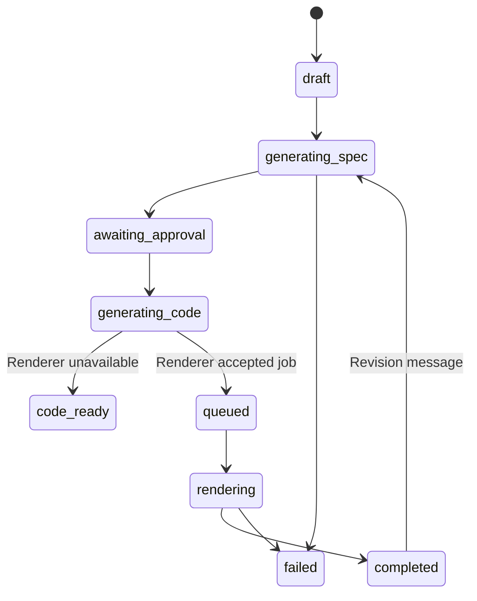
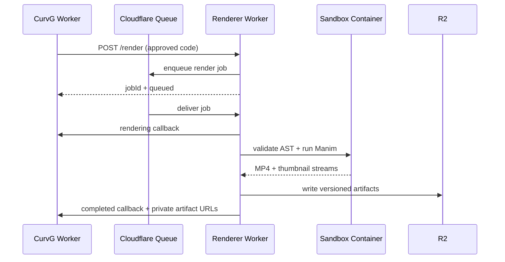

# CurvG Creator Architecture

The current durable Worker → Workflow → Python Orchestrator → Sandbox design is
documented in [ANIMATION_ORCHESTRATION.md](./ANIMATION_ORCHESTRATION.md). This
document retains the broader Creator product and historical renderer context.

## First-principles decomposition

A precise mathematical animation requires four separate truths:

1. **Conversation truth** — what the user requested and how the request changed.
2. **Specification truth** — equations, coordinate systems, objects, timing and transformations before code exists.
3. **Execution truth** — inspectable Manim source generated from the approved specification.
4. **Artifact truth** — immutable rendered files and version metadata stored outside the execution container.

Combining these into one opaque model call makes failures impossible to diagnose. CurvG therefore uses an explicit approval boundary between specification and code generation.

## Reused template infrastructure

- `chat` stores one animation project and its current structured state in `parts`.
- `chat_message` stores the conversation history.
- Better Auth owns user identity and authorization.
- Admin settings provide encrypted OpenAI-compatible or Anthropic credentials.
- D1 stores projects and messages.
- D1 stores generated code and version snapshots; R2 stores videos and thumbnails.

No new database table is required for the first implementation.

## State machine



## Provider boundary

CurvG exposes a provider-neutral chat completion interface. The first adapters are:

- OpenAI-compatible `/chat/completions`, which also supports gateways such as OpenRouter when configured by the administrator.
- Yunwu through its OpenAI-compatible `/v1/chat/completions` endpoint, with credentials stored separately from OpenAI.
- Anthropic `/v1/messages`.

Model IDs are configuration, not source-code constants. This prevents the application from depending on names that change over time.

The Creator model selector loads Yunwu's current OpenAI-compatible model directory from `/v1/models`, keeps text/chat-capable entries, and sends the selected provider/model pair with create, revise and approve requests. `Auto` is available only when an administrator has configured a default model; it does not silently choose an arbitrary catalog entry.

## Renderer boundary

The web application does not execute generated Python. It dispatches approved code to an authenticated renderer endpoint.

The Cloudflare implementation is a separate Worker using Queue, Sandbox SDK, a custom Python image containing Manim, FFmpeg and LaTeX, and R2. The Sandbox filesystem is disposable; final artifacts are streamed to R2 and returned through an authenticated callback.

Until a renderer endpoint is configured, CurvG stops at `code_ready` and clearly reports that rendering is not configured. It does not pretend that a video was rendered.



## Security boundary

- Generated code is untrusted and never runs inside the application Worker.
- Prompt and message lengths are bounded.
- API access is scoped to the authenticated owner.
- Generated code is rejected when it contains direct filesystem, network, subprocess or dynamic-evaluation primitives.
- Renderer callbacks require a shared bearer token.
- Provider and renderer secrets remain server-side and are encrypted in the config table.
- The renderer accepts callbacks only for the configured CurvG origin.
- Queue messages isolate long render time from interactive Worker requests.
- R2 keys include the render job ID, so a revision cannot serve a previous video.
- Artifact routes require the animation owner's session and support byte ranges.
- A Python AST gate permits only Manim, `math` and NumPy imports before execution.

The AST gate is defense in depth, not the primary security boundary. Generated code still runs only inside a disposable Sandbox container with no application or provider secrets.

## Artifact inspection model

The Creator exposes the same three persisted truths used by the backend instead of collapsing them into one preview:

- `Specification` renders formulas, assumptions, scenes, frame layout, area descriptions, dependencies and implementation notes.
- `Code` renders the generated Python as a read-only, line-numbered artifact with copy and `.py` download actions.
- `Video` reads the private MP4 through the authenticated artifact route and shows queued, rendering, completed and failed states.

The right workspace also maps persistent states to `Spec → Approve → Process → Done`. It automatically selects the newest relevant artifact only when the animation ID or status changes, so polling does not override a user's manual tab selection.

The browser first plays the same-origin artifact URL so HTTP Range remains available. A full authenticated Blob download is only a compatibility fallback after native playback fails.

## Implemented files

### Main application

- `src/routes/creator.tsx` — localized Creator route and metadata.
- `src/components/creator-workspace.tsx` — responsive history, conversation, composer, specification, code and video UI.
- `src/routes/api/animations*` — owner-scoped create, revise, approve, callback and artifact APIs.
- `src/modules/animations/service.ts` — state machine, conversation history, version snapshots, spec generation and code generation.
- `src/core/ai/chat.ts` — bounded Yunwu-compatible chat requests, retries and Auto failover.
- `src/config/animation-models.ts` — server-authoritative Creator model and Free/Pro policy.
- `src/core/animation-renderer.ts` — authenticated renderer client.
- `src/lib/animation-schema.ts` — structured specification and generated-code validation.
- `src/modules/config/settings.ts` — model IDs and renderer endpoint settings in the admin panel.

### Renderer Worker

- `renderer/src/index.ts` — authenticated enqueue endpoint, Queue consumer, Sandbox execution, R2 upload and callbacks.
- `renderer/Dockerfile` — Cloudflare Sandbox Python image plus Manim 0.20.1, FFmpeg and LaTeX.
- `renderer/validate_scene.py` — AST validation before Manim execution.
- `renderer/wrangler.jsonc` — Queue, Sandbox Durable Object, Container and R2 bindings.

## Required configuration

For Creator, configure Yunwu in `/admin/settings`:

- `yunwu_base_url` (default: `https://yunwu.ai/v1`).
- `yunwu_api_key`.

Creator does not accept arbitrary provider or model strings. Its API intersects
Yunwu's live catalog with the allowlist in `src/config/animation-models.ts`.
OpenAI and Anthropic settings remain available to unrelated generic AI modules,
but they are not Creator model choices.

After deploying the renderer, configure:

- `animation_renderer_url` — the `curvg-renderer` Worker URL.
- `animation_renderer_token` — the same secret stored as `RENDERER_TOKEN` on the renderer Worker.

## Renderer deployment

The main app already binds D1 as `DB` and R2 as `CURVG_ASSETS`. The renderer binds the same R2 bucket as `ARTIFACTS`.

```bash
npx wrangler queues create curvg-render-jobs
npx wrangler r2 bucket create curvg-assets
npx wrangler secret put RENDERER_TOKEN --config renderer/wrangler.jsonc
pnpm renderer:deploy
```

Docker must be running because Wrangler builds and pushes `renderer/Dockerfile`. Confirm that `renderer/wrangler.jsonc` `CALLBACK_ORIGIN` matches the deployed CurvG origin before deployment.

## Local renderer verification

The renderer can be tested without creating or deploying remote Cloudflare resources. `wrangler dev` starts a local Queue, Sandbox Durable Object and Miniflare-backed R2 bucket while the Sandbox container runs through Docker.

On this Apple Silicon development machine, Docker CLI and Colima are installed through Homebrew. The Sandbox base image is currently `linux/amd64`, so Docker reports a platform warning and runs it through Rosetta. The warning did not prevent the verified render.

```bash
colima start --cpu 4 --memory 6 --disk 20 --vm-type vz --vz-rosetta
docker build --progress=plain -t curvg-renderer-local:dev renderer
pnpm renderer:typecheck

pnpm exec wrangler dev --config renderer/wrangler.jsonc --port 8787 \
  --var CALLBACK_ORIGIN:http://localhost:8788 \
  --var SANDBOX_TRANSPORT:rpc \
  --var RENDERER_TOKEN:<local-test-token>
```

The callback can target the running CurvG application, for example `http://localhost:3000/api/animations/<id>/render-callback`, or a standalone receiver. It must return `{ "code": 0 }` and accept the same bearer token. A render request is sent to `POST http://localhost:8787/render` with `animationId`, `callbackUrl` and valid `CurvGScene` source.

The renderer actively consumes the Sandbox RPC file stream and uploads artifacts with R2 multipart upload in 5 MiB parts. Passing the RPC stream directly to local R2 caused `WritableStream RPC stub was disposed without calling close()` with Sandbox SDK 0.12.4; multipart upload avoids that transport failure without buffering an entire video in Worker memory.

Before upload, FFmpeg remuxes the Manim MP4 with `-movflags +faststart`, placing the `moov` metadata before `mdat` so browsers can read duration and begin playback through byte-range requests. Renderer callbacks store same-origin relative artifact URLs. In production the app reads the shared `CURVG_ASSETS` binding directly; during local development, when that binding is absent, the authenticated artifact route proxies Range requests to the renderer's protected `GET /artifact/:animationId/:jobId/:kind` endpoint.

## Cloudflare fit

Cloudflare is a suitable single-platform choice for this architecture:

- [Sandbox SDK](https://developers.cloudflare.com/sandbox/) is available on Workers Paid and runs untrusted code in isolated Linux containers.
- [Sandbox getting started](https://developers.cloudflare.com/sandbox/get-started/) confirms custom Docker images, command execution, files, Durable Object bindings and production deployment through Wrangler.
- [Sandbox limits](https://developers.cloudflare.com/sandbox/platform/limits/) confirms that Sandbox inherits Container limits and Workers Paid receives 1,000 subrequests per request; this renderer uses RPC transport and Queue jobs instead of a long browser request.
- [Sandbox pricing](https://developers.cloudflare.com/sandbox/platform/pricing/) is based on Containers, plus Workers, Durable Objects and optional logs.
- [R2 Workers API](https://developers.cloudflare.com/r2/api/workers/workers-api-usage/) supports direct Worker bindings and object streaming.

This does not mean rendering is free or operationally zero-cost. Container startup, CPU time, memory, disk, Queue operations, Durable Objects and R2 storage are billed separately according to their current Cloudflare pricing.

## Verification status

Verified on 2026-07-28:

- Yunwu `/models` returned HTTP 200 with 408 advertised model IDs.
- Minimal, sequential chat probes returned HTTP 200 with non-empty text for the seven allowed models: `deepseek-v4-pro`, `deepseek-v4-flash`, `qwen3-coder-plus`, `gpt-5`, `gpt-5.5`, `claude-sonnet-4-6`, and `claude-opus-4-7`.
- `deepseek-v4-pro` is the only Free model. The other six require a current recurring Pro/Enterprise subscription; API authorization is server-side.
- `qwen3-coder` remained advertised but returned HTTP 429 in two separate probe runs, so it was removed. `MiniMax-M3` and the three former Gemini 3.1 aliases were absent from the live catalog and were removed.
- A minimal probe confirms current endpoint acceptance only. It is not evidence of long-form Manim quality or future upstream availability.
- Upstream retry/circuit-breaker behavior, cross-instance capacity leases, payment replay handling, request-size limits, and Free/Pro boundary tests pass in the automated adversarial suite.

Historical verification on 2026-07-24 (superseded model selection):

- The saved Yunwu credential authenticated against `https://yunwu.ai/v1/models`; 403 provider models were returned during the test and the Creator selector loaded the filtered dynamic catalog.
- A direct `deepseek-v4-pro` smoke request returned HTTP 200 and the expected response. Its first full specification request ended with a transient `fetch failed`; the added one-retry policy recovered the next request.
- `deepseek-v4-pro` was not reliable enough for this Manim compiler workload. Live outputs used unsupported `self.camera.frame` on `Scene`, later invented `MathTex.get_scale_factor()`, reassigned an undisplayed Transform target as the next source, and produced one technically valid render whose equations were mis-scaled and overlapped the diagram.
- The same approved workflow was then run with Yunwu `deepseek-chat` (reported by the catalog as DeepSeek V3.2). The final attempt completed without manual source editing: model specification → approval → generated Python → AST validation → Cloudflare Queue → Sandbox → Manim → FFmpeg thumbnail → local R2 → authenticated callback.
- The final `deepseek-chat` artifact was read back from local R2 and inspected: H.264, 1280×720, yuv420p, 30 fps, exactly 6.0 seconds, 103,919 bytes. Four sampled stages show the blue, orange, green and purple layers forming the 1×1 through 4×4 squares; each equation remains visible above the grid without overlap.
- The run exposed and fixed missing guardrails for provider retry behavior, approval-time model audit fields, `self.camera.frame`, guessed Axes helpers, `get_scale_factor`, hidden FadeIn targets, Transform-source reassignment, unpositioned formula targets, text outside the safe frame, non-positive `run_time`, and non-positive `wait` durations.
- The Creator record `5ea16f36-66df-4d9a-b6d0-0f5cf4a83418` finished as `completed` with provider `yunwu`, model `deepseek-chat`, and render job `4f381e2c-817b-40a7-baca-3db7b942b19c`.
- The completed Euler test artifact was normalized from tail-`moov` MP4 to faststart MP4. Renderer and app-proxy Range reads return HTTP 206 with `video/mp4`; FFprobe reports H.264 High, yuv420p, 1280×720, 30 fps and 23.0 seconds.

Verified on 2026-07-22:

- `pnpm build` passes.
- `pnpm cf:build` passes with the Cloudflare module preset.
- The renderer Docker image builds with Manim 0.20.1, FFmpeg and LaTeX.
- The Python AST validator accepts a safe scene and rejects OS command execution.
- A real Manim container rendered `MathTex(r"y=x^2")`, axes and a curve to H.264 MP4.
- Local Wrangler processed Queue → Sandbox → Manim → FFmpeg thumbnail → R2 multipart upload → authenticated `completed` callback.
- The MP4 and JPEG were read back from local R2 rather than trusted from callback state alone.
- The verified MP4 is H.264, 1280×720, 2.5 seconds and 28,727 bytes; the JPEG is 1280×720 and 10,852 bytes.
- `pnpm renderer:typecheck` passes after the renderer fixes.
- Wrangler dry-run packages the renderer Worker and resolves Sandbox, Queue and R2 bindings when run with `--containers-rollout=none`.
- Structured-spec parsing accepts a valid fixture.
- `/creator` returns HTTP 200 and was visually checked at 1440×1000 and 390×844.
- The unauthenticated submit flow redirects to `/sign-in?callbackUrl=/creator`.

Not yet verified:

- No production Sandbox, Queue or R2 resource was created or tested because deployment was intentionally deferred.
- Local Miniflare R2 success proves the application flow and binding API, but it is not evidence that remote Cloudflare account resources, permissions, limits or billing are correctly configured.

## Reference captures

- `docs/design-references/curvg/creator-desktop.png`
- `docs/design-references/curvg/creator-mobile.png`

## Delivery phases

1. Completed: Creator workspace, conversations, specification generation and approval.
2. Completed: Manim code generation and two-stage validation.
3. Implemented, deployment pending: Cloudflare Queue, Sandbox renderer and R2 artifact persistence.
4. Partial: internal version snapshots exist; version restore, publishing and gallery integration remain.
