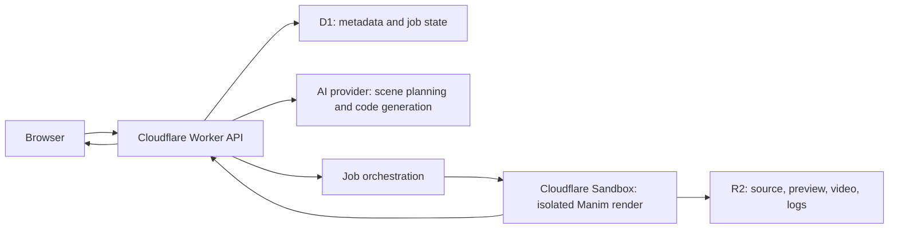

# CurvG 技术架构

更新时间：2026-07-22

## 状态说明

### 已知事实

- 当前项目基于 TanStack Start、React 19、Cloudflare Workers 目标运行时。
- 本地开发使用 SQLite；生产目标数据库是 Cloudflare D1。
- 模板已经提供认证、权限、订阅、积分、支付、AI Provider 和 R2 存储基础模块。
- 当前首页曲线由 TypeScript 公式采样后渲染成 SVG。
- 当前没有 AI 生成接口、Sandbox 任务或 Manim 视频渲染链路。

### 目标架构



## 服务职责

| 服务        | 负责                                             | 不负责                     |
| ----------- | ------------------------------------------------ | -------------------------- |
| Workers     | 鉴权、参数校验、业务编排、状态查询、签名 URL     | 长时间视频渲染             |
| D1          | 用户作品、曲线元数据、版本、任务状态、计费记录   | MP4、GIF、日志大文件       |
| R2          | Manim 源码、缩略图、预览视频、最终视频、渲染日志 | 强事务业务状态             |
| Sandbox     | 在资源限制下执行生成代码和 Manim                 | 保存业务真相、持有长期密钥 |
| AI Provider | 解析意图、生成场景计划和候选代码                 | 直接决定最终数学正确性     |

## 建议的数据模型

这些表尚未创建，进入生成器开发阶段后再加入 `src/config/db/schema.ts`：

- `curve_project`：用户项目、标题、描述、可见性、当前版本。
- `curve_version`：公式输入、参数、场景计划、源码 R2 key、父版本。
- `render_job`：状态、Sandbox job id、输入版本、重试次数、耗时、错误摘要。
- `render_artifact`：类型、R2 key、mime、尺寸、时长、校验和。
- `gallery_entry`：公开状态、标签、排序、封面和 SEO 字段。
- `generation_event`：模型、token 使用、延迟、结果状态、成本估算。

## 渲染任务状态机

`draft → planning → code_ready → queued → rendering → succeeded | failed | cancelled`

规则：

- 每次重试创建新的执行记录，不覆盖原始失败记录。
- `succeeded` 必须同时存在可访问的预览产物和校验元数据。
- 业务状态以 D1 为准，R2 文件存在不代表任务成功。
- Worker Webhook/回调必须幂等。

## R2 对象结构建议

```text
users/{userId}/projects/{projectId}/versions/{versionId}/scene.py
users/{userId}/projects/{projectId}/renders/{renderId}/preview.mp4
users/{userId}/projects/{projectId}/renders/{renderId}/final.mp4
users/{userId}/projects/{projectId}/renders/{renderId}/thumbnail.webp
users/{userId}/projects/{projectId}/renders/{renderId}/render.log
gallery/{entryId}/cover.webp
```

## 安全要求

- 模型生成代码只能在 Sandbox 内执行，不能在 Worker 或应用服务器中执行。
- Sandbox 不注入数据库、支付、AI Provider 等生产密钥。
- 对 CPU、内存、磁盘、执行时间、输出大小和并发量设置硬限制。
- 只允许固定基础镜像和锁定版本的 Manim 依赖。
- 保存源码哈希、镜像版本、渲染参数和产物校验和，保证可追踪。
- 网络访问策略、Sandbox 生命周期和并发限制必须在接入前依据 Cloudflare 最新文档实测；本文不把未验证的产品限制写成事实。

## 为什么暂不定价

真实单位成本至少包含：AI token、Sandbox 执行时间、并发等待、R2 存储、读取与转码。没有 50–100 个代表性场景的实测数据，任何套餐额度都只是猜测。
