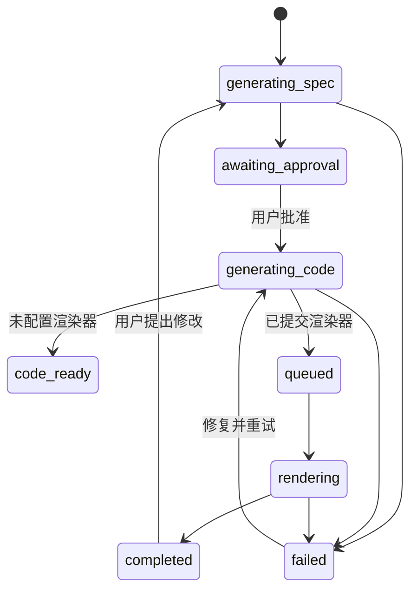

# AnimG 代码与成品展示逻辑拆解

- 复查日期：2026-07-27
- 目标：首页、Creator、Playground、公开动画详情页
- 目标站点：<https://animg.app/en>
- CurvG 对应页面：`/creator`

## 明确结论

AnimG 的核心不是“把提示词直接变成视频”，而是把一次生成拆成三个可检查的产物：

1. `Specification`：先固定数学目标、分镜、布局和时长。
2. `Code`：规格批准后生成 Manim Python。
3. `Video`：服务端执行 Manim，产出 MP4 和缩略图。

前端只是状态机和产物检查器。真正决定稳定性的部分在服务端：结构化规格、代码约束、隔离渲染、错误回传和版本快照。

## 已验证的页面行为

### 首页

- 产品流程明确显示为 `Spec → Approve → Process → Done`。
- Creator 示意图同时展示 `Spec`、`Code`、`Video` 三类产物。
- 产品声明是在浏览器中提交提示词，服务端生成 Manim 代码和渲染视频，不要求用户安装 Python、Manim 或 FFmpeg。

### Creator

- 未登录时仍可看到完整输入界面，但提交需要认证。
- 输入上限为 5,000 字符。
- 输入参数包含 `Subject` 和 `Model`。
- 左侧是动画历史，中间是对话与审批，成品区域随任务状态变化。

### 公开动画详情

- 视频使用原生 `<video controls>`，包含 MP4 地址和 poster 缩略图。
- 页面提供 `Specification` 与 `Code` 标签切换。
- 规格包含概述、阶段时长表、ASCII 布局、区域说明、依赖和实现备注。
- 代码为只读 Python 展示，使用等宽字体和语法着色，提供复制按钮。
- 现场样本没有行号，也不是可编辑 Monaco 实例。

### Playground

- 使用 Monaco Editor 编辑 Python。
- 顶部提供 `Low`、`High` 质量选择与 `Render` 按钮。
- 页面同时存在编辑器和视频预览。
- 这是“代码编辑器 + 服务端渲染”，不是浏览器内执行 Manim。

## 已验证的状态与接口线索

以下接口和字段来自已发往浏览器的前端资源，属于可观察实现，不代表已获得竞品服务端源码：

- `POST /api/create-animation-spec`
- `POST /api/approve-animation-spec`
- `POST /api/animations/:id/update`
- `POST /api/playground/render`
- `POST /api/playground/fix-code`
- `GET /api/playground/usage`

持久状态包括 `draft`、`pending`、`processing`、`completed`、`failed`；前端还使用创建规格、生成元数据和更新渲染等瞬时状态。

## 无法确认的部分

公开页面无法证明以下信息：

- Manim 实际运行在 Cloud Run、Kubernetes、Functions 还是其他容器平台。
- 服务端系统提示词、代码模板库和自动修复提示词的具体内容。
- 是否使用 SymPy 做数学等价性验证。
- 是否执行 Python AST 白名单或网络隔离。

因此 CurvG 只能复现可观察的产品逻辑，不能声称复制了竞品私有后端源码。

## CurvG 的对应实现

### 状态机

### 数据产物

`AnimationParts` 保存：

- `spec`：结构化规格。
- `code`：通过基础安全校验的 Manim Python。
- `videoUrl`、`thumbnailUrl`：当前渲染产物。
- `render`：渲染任务 ID、供应方和状态。
- `versions`：修改前的规格、代码和视频快照。
- `error`：模型、验证或渲染错误。

### 规格结构

CurvG 在原有标题、摘要、公式、假设、风格和分镜基础上补充：

- `layout`：ASCII 画面布局。
- `areas`：区域内容与 Manim 实现方式。
- `dependencies`：LaTeX、字体和对象依赖。
- `notes`：数学不变量与实现限制。

旧数据缺少这些字段时仍可读取，新生成规格会要求模型输出这些字段并经过 Zod 校验。

### 成品检查器

右侧检查器复现三产物逻辑：

- 顶部显示 `规格 → 批准 → 处理 → 完成` 进度。
- `Specification` 显示结构化规格。
- `Code` 显示只读 Python、语法着色、行号、复制和 `.py` 下载。
- `Video` 显示任务状态、加载动画、原生播放器和失败重试。
- 状态变化时自动切换到最相关产物：规格完成看规格，代码生成看代码，渲染完成看视频。

### 视频存储差异

AnimG 的公开样本直接使用 Google Cloud Storage URL。CurvG 不照搬这一点：

- R2 对象保持私有。
- 浏览器通过已登录的 `/api/animations/:id/artifact/:kind` 读取。
- 路由支持 HTTP Range，保证原生视频拖动和分段读取。
- 播放时先使用原生同源 URL；浏览器读取失败后才回退为认证 Blob。

这比公开对象地址更适合会员制产品，也不会把未发布作品直接暴露在公共存储 URL 上。

## 当前仍未解决的产品风险

1. 代码成功渲染不等于数学结论正确，仍需要 SymPy 或模板级验证。
2. 当前代码校验主要覆盖结构和危险操作，不是完整 Python AST 沙箱。
3. 自动修复次数必须受限，否则失败任务会持续消耗模型和渲染费用。
4. 视频播放需要在真实 Cloudflare Sandbox → R2 环境继续验证 Range、Content-Type 和跨区域延迟。

## 验收标准

- 新动画先出现规格，不会未经批准直接执行 Python。
- 规格能展示布局、区域、依赖和备注。
- 批准后能看到完整 Manim 源码并下载 `.py`。
- `queued`、`rendering` 时视频区显示处理状态。
- `completed` 时自动切换视频，原生播放器可以播放和拖动。
- `failed` 时保留规格和代码，错误可见且允许重新生成。
- 修改已完成动画时保存上一版规格、代码和视频引用。
