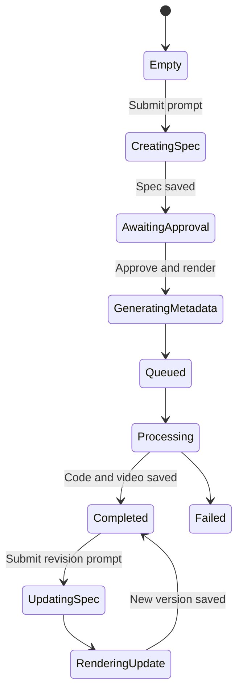

# AnimG Creator Interaction Model

Verified with the authenticated Ego Lite session on 2026-07-22.

Target: <https://animg.app/en/creator?animationId=R7nZ818ESbyNDVfAW0bD>

## Verified frontend architecture

- Next.js App Router frontend.
- Firebase Authentication provides the user token.
- Firestore stores animation documents and pushes real-time status changes with a live query scoped by `userId`.
- Backend generation calls use authenticated HTTP APIs.
- OpenRouter is the model gateway exposed by the shipped frontend bundle.

The supplied animation ID was not present in the authenticated account's animation list, so the page redirected to the empty Creator state. No generation request was submitted and no user quota was consumed.

## Actual workflow



This is not a one-call text-to-video flow. It separates intent planning from execution:

1. User submits a prompt, subject and model.
2. Client creates a Firestore animation document with `status: draft`.
3. `POST /api/create-animation-spec` produces a structured animation specification.
4. User reviews the specification and explicitly approves it.
5. `POST /api/approve-animation-spec` generates metadata, Manim code and starts rendering.
6. Firestore status changes drive the progress UI.
7. Completed animations expose Specification, Code and Video tabs.
8. A later user message calls `POST /api/animations/:id/update` and creates a new version.

## Observed request contracts

### Create or revise specification

`POST /api/create-animation-spec`

```json
{
  "message": "user prompt",
  "animationId": "firestore document id",
  "model": "provider/model",
  "messageHistory": [{ "sender": "user", "content": "...", "type": "text" }]
}
```

### Approve and render

`POST /api/approve-animation-spec`

```json
{
  "animationId": "firestore document id",
  "model": "provider/model"
}
```

### Update a completed animation

`POST /api/animations/:id/update`

```json
{
  "description": "revision instruction",
  "model": "provider/model"
}
```

## Data and UI state

Observed animation fields include:

- `userId`, `title`, `subject`, `status`
- `messages`
- `specContent`
- `code`
- `videoUrl`, `thumbnailUrl`
- `description`, `tags`, `aiModel`
- `previousVersions`
- `error`, `isPublished`, `slug`

Persistent statuses include `draft`, `pending`, `processing`, `completed` and `failed`. Client-only progress states include `creatingSpec`, `updatingSpec`, `generatingMetadata` and `renderingUpdate`.

## Interaction details

- Desktop uses a collapsible animation-history sidebar and a full-height editor.
- Mobile replaces the sidebar with a drawer.
- The prompt remains anchored at the bottom of the workspace.
- Prompt limit is 5,000 characters.
- Subject options are General, Math, Physics, Computer Science, Biology, Chemistry and Economics.
- Model access is plan-gated; the free account is limited to two animations.
- Completed output is inspectable through Specification, Code and Video tabs.
- Revision messages create visual version boundaries and preserve previous output snapshots.

## Reference captures

- `docs/design-references/animg.app/creator-logged-in-empty.png`
- `docs/design-references/animg.app/creator-mobile-empty.png`
- `docs/design-references/animg.app/creator-subject-menu.png`
- `docs/design-references/animg.app/creator-model-menu.png`
